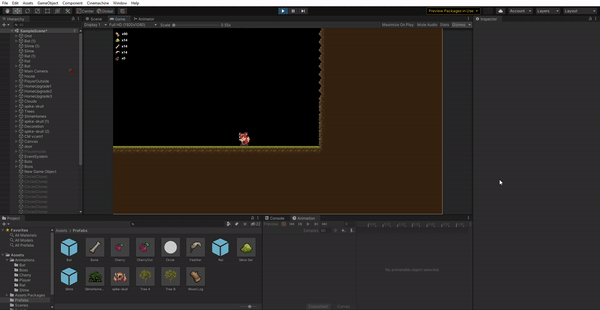
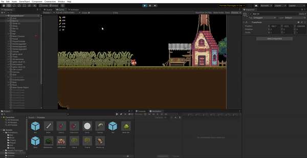
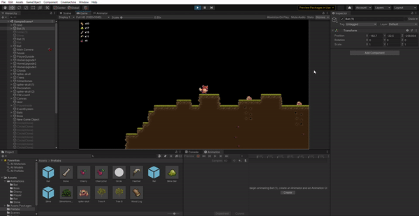
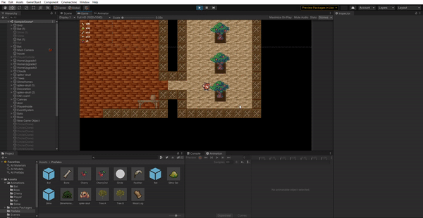
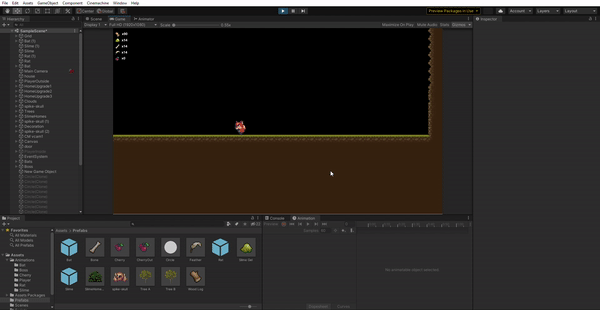

# UnityGameisThisDestiny - Unity Uygulaması

## Herkese Selamlar

Bu proje, Unity ile yaptığım bir ***2D Platformer Game*** deneme projem.

Bu projeyi yapmamdaki amaç; Unity ile 2D Platformer oyun yaparkenki süreci planlayıp, bu oyuna uygun olabilecek mekanikler deneyerek oyun yapım sürecini deneyimlemekti.

Sonuç olarak kendim tasarlayıp ortaya çıkardığım 15-25 dakikalık kısa bir 2D Platformer oyun demosu ortaya çıkarttım.
## İçindekiler

0. [Herkese Selamlar](#herkese-selamlar)
1. [Uygulama Hakkında](#uygulama-hakkında)
2. [Youtube Linki](#youtube-linki)

## Uygulama Hakkında

Oyun içerisinde amaç oyuncunun evini upgrade ederek oyun sonunda Boss'a ulaşmak. Her ev upgrade'i ile birlikte yeni mekanikler açılıyor ve bu mekanikler ile bir sonraki upgradelere gerekli olan malzemelerin toplanması sağlanıyor.

W tuşu ile zıplanıyor ve A/D tuşları ile sola/sağa gidiliyor. 

Bir canlının üzerine gelinip E tuşuna basıldığı zaman o canlı ile etkileşime giriliyor.

Alpha1 tuşuna basarak melee mekaniği aktif ediliyor. (Her zaman aktif edilebilir)

Alpha2 tuşuna basarak range mekaniği aktif ediliyor. (İlk Upgrade'den sonra aktif edilebilir.)

Alpha3 tuşuna basarak hook mekaniği aktif ediliyor. (İkinci Upgrade'den sonra aktif edilebilir.)

Alpha4 tuşuna basarak fly mekaniği aktif ediliyor.  (Üçüncü Upgrade'den sonra aktif edilebilir.)

## Youtube Linki

Youtube üzerinden paylaştığım uygulama videosuna [bu linkten](https://youtu.be/q6K7yAp-kCs) ulaşabilirsiniz.
